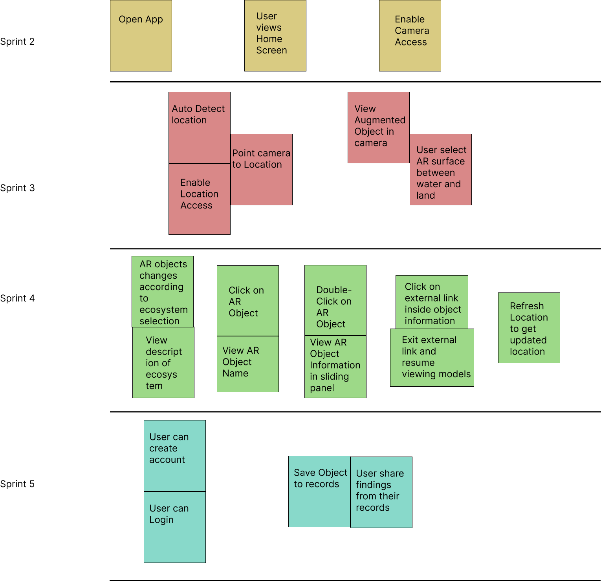

# Project Management

This page provides a general overview of the assigned tasks and roles for the duration of five sprints (subject to change).

## Story map

## Project Plan
### Sprint 1
*Due: January 28* 

**Tasks**

| **Task**        | **Related US** | **Assigned To** | **Due Date** |
| --------------- | ------------------- | -------------------- | ------------------------- |
| Project Summary and Glossary | Documentation | Kevin Sha | Jan 27 |
| User Stories | Documentation | Raunak Agarwal, Mohammad Hammad, Vaibhav Chugh | Jan 27 |
| Similar Products and Technical Sources | Documentation | Huy Ta | Jan 27 |
| Software Architecture and Sequence Diagram | Documentation | Yui Han | Jan 27 |
| UML Components and Class Models | Documentation | Mohammad Hammad | Jan 27 |
| Low Fidelity Wireframes| Documentation | Vaibhav Chugh | Jan 27 |
| Story Map | Documentation | Raunak Agarwal | Jan 27 |
| Project Planning | Documentation | Vaibhav Chugh, Kevin Sha | Jan 27 |
| Teamwork Docs | Documentation | Kevin Sha, Yui Han | Jan 27 |
| Meeting Minutes | Documentation | Yui Han | Jan 27 |

### Sprint 2
*Due: February 11* 

**User Stories**

| **User Story** | **Story Points** |
| --------------- | ------------------- |
| SETUP - Setting up dev environment | 8 |
| US 01.01 - User views home screen| 1 |
| US 01.05 - User use camera | 2 |

Estimated Sprint Velocity: **11**

**Tasks**

| **Task**        | **Related US** | **Assigned To** | **Due Date** |
| --------------- | ------------------- | -------------------- | ------------------------- |
| Unity setup + firebase | SETUP | Mohammad Hammad | Feb 8 |
| Create camera display | US 01.05 | Raunak Agarwal, Huy Ta | Feb 11 |
| Create unity landing page | US 01.01 | Vaibhav Chugh, Yui Han, Raunak Argarwal | Feb 9 |
| Replan sprints and storymap | Documentation | Kevin Sha | Feb 9 |
| Update architecture diagram and meeting minutes | Documentation | Yui Han | Feb 9 |
| Update user stories | Documentation | Raunak Agarwal | Feb 9 |
| Update similar open source projects | Documentation | Huy Ta | Feb 9 |
| Testing | Testing | Huy Ta | Feb 11 |

### Sprint 3
*Due: March 4*

**User Stories**

| **User Story** | **Story Points** |
| --------------- | ------------------- |
| US 01.02 - User assigned location| 3 |
| US 01.04 - User toggle surface | 3 |
| US 02.01 - User view models | 5 |
| US 01.03 - User manually enters location | 3 |
| US 04.01 - User identify species | 8 |

Estimated Sprint Velocity: **22**

**Tasks**

| **Task**        | **Related US** | **Assigned To** | **Due Date** |
| --------------- | ------------------- | -------------------- | ------------------------- |
| Integrate Geolocation API to determine current location | US 01.02 | Vaibhav Chugh, Kevin Sha  | Feb 20 |
| Create proper UI to show the current location | US 01.02 | Raunak Agarwal, Vaibhav Chugh, Kevin Sha  | Feb 24 |
| Create a toggle switch that allows user to set their surface as land or water | US 01.04 | Yui Han, Mohammad Hammad | Feb 24 |
| Spawn AR objects on selected surface | US 02.01 | Mohammad Hammad, Huy Ta | Mar 1 |
| Fix docs according to TA feedback | Documentation | Raunak Agarwal, Vaibhav Chugh, Yui Han | Mar 1 |
| Update Wireframes | Documentation | Vaibhav Chugh | Mar 1 |
| Sprint 4 planning | Documentation | Yui Han | Mar 1 |
| Unit Testing, UI Testing | Testing | Raunak Argarwal, Huy Ta | Mar 1 |

### Sprint 4
*Due: March 18*

**User Stories**

| **User Story** | **Story Points** |
| --------------- | ------------------- |
| US 01.06 - Admin add models | 2 |
| US 02.02 - User view ecosystem description | 5 |
| US 02.03.01 - User click model | 3 |
| US 02.03.02 - User navigate object link | 5 |
| US 04.03 - User detects water body and land with camera | 5 |

Estimated Sprint Velocity: **20**

**Tasks**

| **Task**        | **Related US** | **Assigned To** | **Due Date** |
| --------------- | ------------------- | -------------------- | ------------------------- |
| Select models based on client provided species, add models to database as admin | US 01.06 | Huy Ta, Raunak Argawal | Mar 12 |
| View model description upon clicking | US 02.03.01 | Mohammad Hammad, Huy Ta | Mar 12 |
| View ecosystem description | US 02.02 | Yui Han, Mohammad Hammad, Raunak Argawal | Mar 12 |
| Embed clickable link in model description | US 02.03.02 | Kevin Sha, Vaibhav Chugh| Mar 13 |
| Allow user to nagivate model description link by opening an external web page, and be able to exit the link to resume viewing the model description in app | US 02.03.03 | Vaibhav Chugh, Huy Ta | Mar 13 |
| Sprint 5 planning| Documentation | Yui Han, Kevin Sha | Mar 16 |
| Unit Testing, UI Testing, Nagivagtion Testing | Testing | Kevin Sha, Raunak Argawal, Yui Han, Mohammad Hammad | Mar 16

### Sprint 5
*Due: April 4*

**User Stories**

| **User Story** | **Story Points** |
| --------------- | ------------------- |
| US 03.01 - User create account | 5 |
| US 03.02 - User login to account | 5 |
| US 03.03 - User save object | 5 |
| US 04.02 - User share findings | 8 |

Estimated Sprint Velocity: **23**

**Tasks**

| **Task**        | **Related US** | **Assigned To** | **Due Date** |
| --------------- | ------------------- | -------------------- | ------------------------- |
| Create user account | US 03.01 | Huy Ta, Raunak Argawal | Apr 02 |
| User login to account | US 03.02 | Yui Han, Kevin Sha, Mohammad Hammad | Apr 02 |
| User save findings in account | US 03.03 | Vaibhav Chugh, Huy Ta | Apr 02 |
| User share findings | US 04.02 | Vaibhav Chugh, Kevin Sha, Mohammad Hammad | Apr 02 |
| Unit Testing, UI Testing, Nagivagtion Testing | Testing | Kevin Sha, Raunak Argawal, Yui Han | Apr 03

