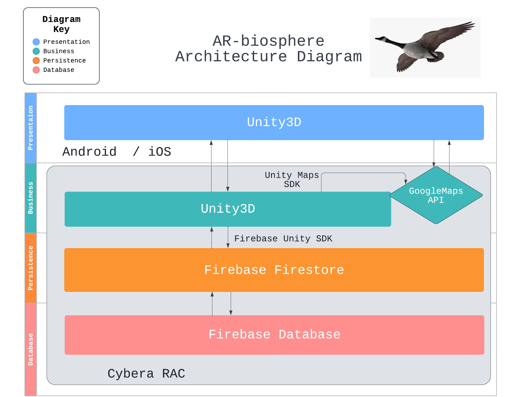
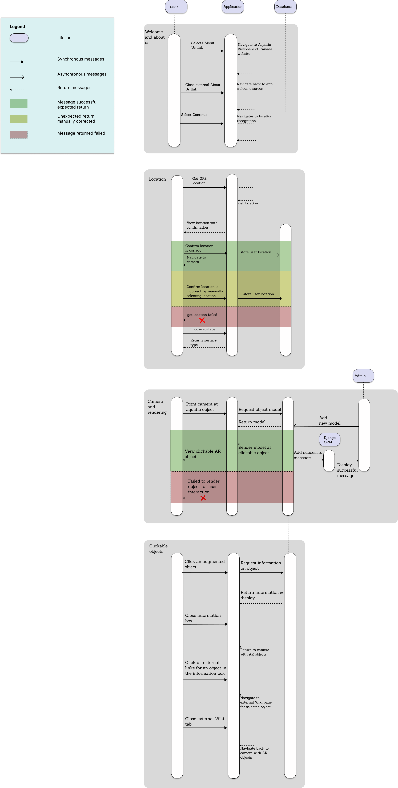

# Software Design

## Architecture Diagram

Our project will use the N-tier layered architecture format, we plan on using Unity3D for the user interface of the presentation layer, and the main logic of our app will be contained in Unity3D as well. The presentation layer will be built with Unity's built in UI Toolkit, and the Maps SDK in Unity will allow the Google Maps API to be used in the business layer to assist location detection. We also will use Unity3D to access camera, detect surfaces, and build all AR related functionality through the AR Foundation Framework that allows adaptation to both Android and iOS without further changes. We will use Firebase Firestore as the persistence layer for accessing AR models, and a Firestore database for storing 3D models and their information that we will use for the AR experience. Our Firebase project and Unity will be integrated with Firebase Unity SDK, where it will be configured for both Android and iOS. The backend of the project will be hosted on Cybera RAC. 

## UML Class Diagram

The Aquatic Biosphere app is comprised of three distinct scenes: HomeScreen, UserLocation, and ARCamera. Navigation between these scenes is facilitated by the Navigation class, which provides convenient methods for accessing the succeeding and preceding scenes from any given scene. The HomeScreen scene serves as a welcoming introduction to the app and directs the user to the Aquatic Biosphere project page. Moving forward, the UserLocation scene employs Google's maps API to confirm the user's location. Finally, the ARCamera scene is responsible for managing all the AR models that appear on the screen, utilizing the ObjectManager class to accomplish this task. Users can access information about these models through a pop-up that is spawned by the ModelInfoView class, and this information is pulled from our database, which is managed using the DBHandler class. Throughout the app, 3-dimensional vectors play a prominent role, and these vectors are represented using our custom Vector3 class.

## Sequence Diagram

The sequence diagram features the four most important interactions in our app: login, location recognition, camera view, and information view. From opening the app, users may choose to login. After which, all users must set their location either automatically through a built in maps API, or manually enter their location if the GPS is incorrect. Once location is set, users will be navigated to their camera view that allows them to point their camera at aquatic objects in order to see an AR of said object on screen. Users may view information about objects by clicking on them, where they may choose to navigate further to external Wiki sites through embedded links. Users may choose to save objects to their account database, if logged in. 

## Low-Fidelity User Interface 

[Wireframes](https://balsamiq.com/learn/articles/what-are-wireframes/) are used to show the overall look and feel of your app, as well as the high-level user-interaction design. Looking at the wireframes, anyone should be able to get an idea of what will be developed. Low fidelity wireframes are just a quick sketch that can make ideas more tangible. They are focused on the “big picture” of the project.

Wireframes for this project were made using [Balsamiq](https://balsamiq.com/). They provide a clear overview of the app structure, layout, information architecture, user flow, functionality, and intended behaviors.

